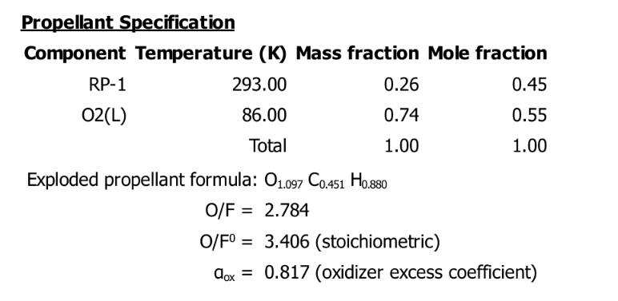
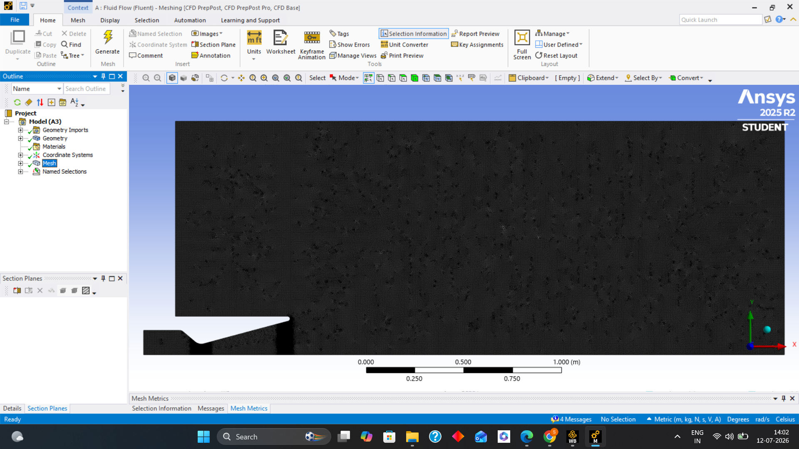

# 🚀 Multiphysics Analysis of a Convergent–Divergent Rocket Nozzle

An independent aerospace engineering project focused on the design, analysis, and validation of a convergent–divergent rocket nozzle using theoretical calculations, Rocket Propulsion Analysis (RPA), Computational Fluid Dynamics (ANSYS Fluent), and thermo-structural simulations (ANSYS Mechanical).

---

# Project Objective

The objective of this project was to investigate the complete behaviour of a rocket nozzle under realistic operating conditions by integrating multiple engineering approaches:

- Analytical compressible flow calculations
- Rocket Propulsion Analysis (RPA)
- CFD simulation
- Structural analysis
- Thermal analysis

---

# Software Used

- ANSYS Fluent
- ANSYS Mechanical
- Rocket Propulsion Analysis (RPA)
- Autodesk Fusion 360 (Geometry)
- Microsoft Excel

---

# Repository Contents

- Project Report
- RPA Design and Results
- CAD Geometry
- CFD Setup
- CFD Results
- Structural Analysis
- Thermal Analysis
- Simulation Images
- References

---

# Methodology

The workflow followed in this project:

1. Analytical nozzle design
2. Rocket Propulsion Analysis (RPA)
3. CAD geometry creation
4. CFD simulation
5. Structural analysis
6. Thermal analysis
7. Validation using analytical and RPA results
8. Performance evaluation

---

# RPA-Based Design

## Propellant

- **Fuel:** RP-1 (Rocket Propellant-1)
- **Oxidizer:** Liquid Oxygen (LOX)

---

## Operating Conditions

| Parameter | Value |
|-----------|-------|
| Chamber Pressure | 30 bar |
| Chamber Diameter | 25 cm |
| Throat Diameter | 10 cm |
| Exit Diameter | 35 cm |
| Nozzle Length | 75 cm |
| Divergent Half Angle | 15° |

The nozzle dimensions and operating conditions were first determined analytically and then refined using Rocket Propulsion Analysis (RPA) before performing numerical simulations.

---

# RPA Results

| Parameter | Value |
|------------|---------|
| Thrust | 31.87 kN |
| Specific Impulse | 236.75 s |
| Exhaust Velocity | 2321.69 m/s |
| Mass Flow Rate | 16.41 kg/s |
| Thrust Coefficient | 1.3526 |

---

# Geometry

A two-dimensional axisymmetric convergent–divergent nozzle geometry was developed in Autodesk Fusion 360 based on the dimensions obtained from the analytical design and RPA.

The geometry consists of:

- Combustion chamber
- Converging section
- Throat
- Diverging nozzle

The conical nozzle with a 15° divergent half-angle was selected to obtain efficient supersonic expansion while maintaining manufacturing simplicity.

---

# CFD Setup

## Solver

- Density-Based
- Transient
- 2D Axisymmetric

## Boundary Conditions

- Inlet Pressure = 30 bar
- Inlet Temperature = 3567 K
- Outlet Pressure = 1 atm

## Working Fluid

RP-1 + LOX combustion products

---

# CFD Results

| Parameter | Value |
|------------|---------|
| Thrust | 33.65 kN |
| Exhaust Velocity | 2660 m/s |
| Specific Impulse | 271.15 s |
| Mass Flow Rate | 15 kg/s |
| Thrust Coefficient | 1.428 |

The CFD simulation successfully captured:

- Choked flow at the nozzle throat
- Supersonic expansion through the divergent section
- Pressure and velocity variations
- Shock structures (Mach diamonds)
- Underexpanded nozzle behaviour at the nozzle exit

---

### Mach Number Distribution

### Pressure Distribution

### Velocity Distribution

### Density Distribution

---

# Structural Analysis

Material Used: **Inconel 718**

A static structural analysis was performed to evaluate the mechanical integrity of the nozzle under internal pressure loading.

The structural simulation evaluated:

- Von-Mises Stress
- Total Deformation
- Pressure loading
- Structural safety

The deformation obtained was extremely small, indicating that the nozzle maintains its geometry under operating pressure.

---

# Thermal Analysis

A steady-state thermal analysis was carried out to investigate the temperature distribution and heat transfer characteristics throughout the nozzle.

The study evaluated:

- Temperature distribution
- Heat flux
- Thermal loading

The maximum temperature observed was approximately **960°C**, which is below the melting temperature of Inconel 718, demonstrating its suitability for the operating conditions

---

# Validation

The CFD results were validated against:

- Analytical calculations
- Rocket Propulsion Analysis (RPA)

The comparison showed good agreement in:

- Choked flow behaviour
- Pressure distribution
- Thrust
- Specific impulse
- Flow expansion characteristics

This validation increases confidence in the numerical methodology adopted for the project.

---

# Key Learning Outcomes

- Compressible flow and quasi-one-dimensional nozzle theory
- Rocket propulsion fundamentals and nozzle performance analysis
- CFD simulation of high-speed supersonic flow
- Choked flow and Mach diamond formation
- Underexpanded and overexpanded nozzle flow behaviour
- Shock wave formation and nozzle exit flow characteristics
- Thermo-structural analysis of high-temperature components
- Multi-physics engineering workflow integrating analytical, RPA, CFD, thermal, and structural analyses

---

# Future Improvements

- Regenerative cooling analysis
- 3D CFD simulation
- Turbulence model comparison
- Nozzle optimization
- Experimental validation

---

# Author

**Shivam Verma**

B.Tech Mechanical Engineering  
National Institute of Technology Calicut

## Areas of Interest

- Rocket Propulsion
- Computational Fluid Dynamics (CFD)
- Aerospace Engineering
- Thermal Engineering
- High-Speed Compressible Flows
- Numerical Simulation
